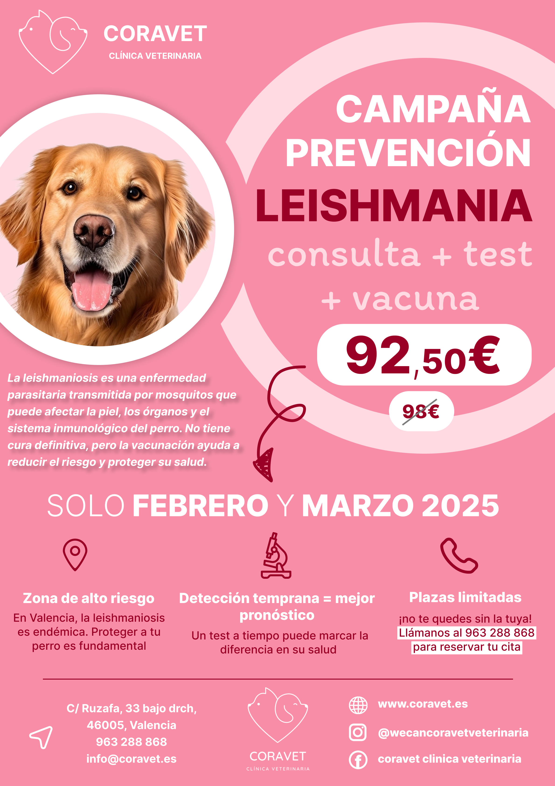

# Veterinarian Marketing Leishmania

Here is the communication I produced to help a (friend) veterinary clinic promote its vaccination campaign against Leishmaniasis.   

## Description  

Leishmaniasis is a serious and potentially fatal disease affecting dogs, caused by the Leishmania parasite and transmitted through the bite of infected sandflies. It can lead to severe skin lesions, weight loss, anemia, and organ damage, particularly affecting the kidneys. The disease is prevalent in warm and humid regions, such as Southern Europe, South America, and parts of Asia and Africa. Since there is no complete cure, prevention is essential. Vaccination, combined with insect repellents and limiting outdoor exposure during peak sandfly activity, significantly reduces the risk of infection. Protect your dog with vaccination and prevent unnecessary suffering!  

  

## Table of Contents

- [Contributing](#Contributing)
- [License](#License)  

## Contributing

Pull requests are welcome. For major changes, please open an issue first
to discuss what you would like to change.

Please make sure to update tests as appropriate.

## License  

This project is licensed under the MIT License - see the [LICENSE](./LICENSE) file for details.